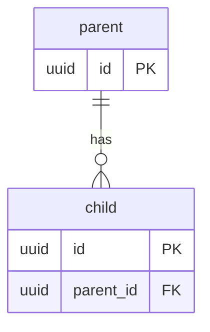
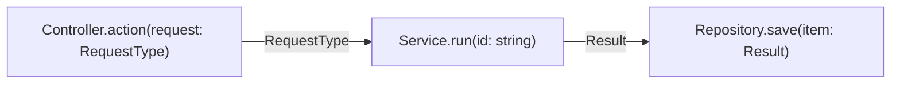

# {{plan-slug}} — architecture spec

<!-- Contract: commands/_shared/architecture-spec.md. `bin/gate.sh arch` refuses a spec that breaks it.
     Structure only: no method bodies, no prose about how the design was reached. Save this file
     beside the plan as plans/{{plan-slug}}.arch.md. Replace every row below; delete none of the
     sections. A feature with no database writes `n/a: <reason>` under Data model and no table.
     Change: the plan slug, every table, interface, path and reuse row. Delete this comment: the gate
     refuses a spec that still holds a double brace or a `path/to/` value. -->

## Data model

| table | column | type | null | key | index | references |
|-------|--------|------|------|-----|-------|------------|
| parent | id | uuid | no | PK | pk_parent | |
| child | id | uuid | no | PK | pk_child | |
| child | parent_id | uuid | no | FK | ix_child_parent_id | parent.id |

## Data flow

<!-- Every node names an interface method with its typed parameters. Every arrow names what crosses it. -->

## Interfaces

<!-- params is `-` or `name: type, name: type`. Write a union type with an escaped pipe. -->

| interface | method | params | returns | throws | layer |
|-----------|--------|--------|---------|--------|-------|
| Controller | action | request: RequestType | Response | - | http |
| Service | run | id: string | Result | NotFound | service |
| Repository | save | item: Result | void | - | data |

## Layers & placement

| logic | layer | file |
|-------|-------|------|
| input validation | http | path/to/Request.ext |
| business rule | service | path/to/Service.ext |
| persistence | data | path/to/Repository.ext |

## Reuse map

<!-- One row per capability this change needs. `reuse` and `extend` name an existing symbol by path.
     `new` states in `reason` what was searched before deciding nothing exists. -->

| need | existing symbol | decision | reason |
|------|-----------------|----------|--------|
| save with a transaction | path/to/BaseRepository.ext | extend | shares transaction handling |
| number generator | - | new | searched the source tree for a generator; none exists |

## Size budgets

| path | max lines | max method lines |
|------|-----------|------------------|
| path/to/Service.ext | 200 | 30 |
