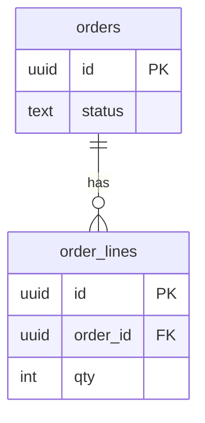
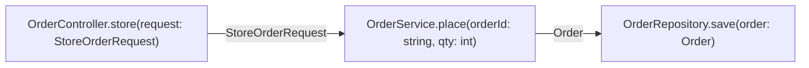

# Order placement — architecture spec

Worked example of the code profile. `commands/_shared/architecture-spec.md` owns the rules.

## Data model

| table | column | type | null | key | index | references |
|-------|--------|------|------|-----|-------|------------|
| orders | id | uuid | no | PK | pk_orders | |
| orders | status | text | no | | ix_orders_status | |
| order_lines | id | uuid | no | PK | pk_order_lines | |
| order_lines | order_id | uuid | no | FK | ix_order_lines_order_id | orders.id |
| order_lines | qty | int | no | | - | |

## Data flow

## Interfaces

| interface | method | params | returns | throws | layer |
|-----------|--------|--------|---------|--------|-------|
| OrderController | store | request: StoreOrderRequest | JsonResponse | - | http |
| OrderService | place | orderId: string, qty: int | Order | OutOfStock | service |
| OrderRepository | save | order: Order | void | - | data |

## Layers & placement

| logic | layer | file |
|-------|-------|------|
| request validation | http | app/Http/Requests/StoreOrderRequest.php |
| stock rule and order placement | service | app/Services/OrderService.php |
| persistence | data | app/Repositories/OrderRepository.php |

## Reuse map

| need | existing symbol | decision | reason |
|------|-----------------|----------|--------|
| transactional save | app/Repositories/BaseRepository.php | extend | shares transaction handling |
| order number | - | new | searched app/ for `Number`; no generator exists |

## Size budgets

| path | max lines | max method lines |
|------|-----------|------------------|
| app/Services/OrderService.php | 200 | 30 |
| app/Repositories/OrderRepository.php | 120 | 25 |
