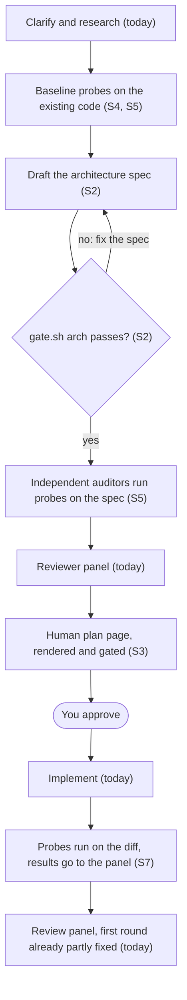
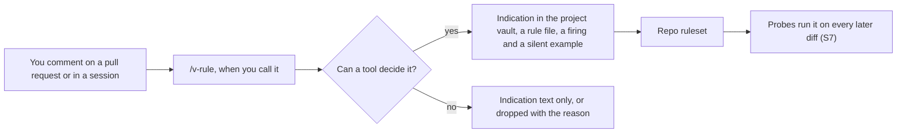
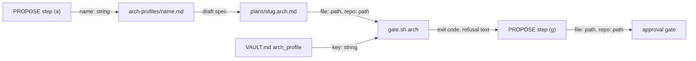

# architecture-first-planning — architecture spec (sessions S1 to S3)

## Diagrams

### How a plan is produced after this work



The review panel exists three times and stays three commands: `/v-team`, `/v-work` and `/v-cr`. Each reads the same probe results.

### Your review comments become rules, on demand (S8)



Nothing calls `/v-rule` by default. It reads only comments from your own account, because anyone can comment on a public pull request.

## Operator requests

| request | sessions | note |
|---------|----------|------|
| 1. A human-readable plan with a schema graph, a data-flow graph and interface signatures | S2, S3 | S2 defines the checked data; S3 renders it as a page |
| 2. A master plan with a plan per sub-step, ordered across repos | S6 | every master plan carries a table of the shapes one session hands to the next, and a gate refuses one without it |
| 3. Deterministic probes run by independent agents before the plan is shown | S4, S5, S9 | duplicate columns, missing indexes, similar methods, naming, complexity |
| 4. Longer planning so execution needs less attention | S2, S5 | the spec is a required gate, and the added cost is capped at 50% of PROPOSE |
| 5. Probes after execution, and review comments become rules | S7, S8 | S7 puts probe results in every panel; S8 is the on-demand rule skill |
| 6. The human plan is an Artifact linked from the agent plan | S3 | the `human_plan` key holds the link |
| 7. It works for non-code work such as AI harness repos | S2, S4 | a second profile: file tree, load order, size budgets, config points |

## File tree

```text
bin/gate.sh                                   gains `arch`, and calls it from `all --phase propose|approve`
bin/doc-lint.sh                               gains type arch-spec, cap 300
lib/arch-check.sh                             new, every check behind `gate.sh arch`
lib/shared-module-rules.tsv                   one owned-rule row for the new shared module
commands/_shared/architecture-spec.md         new, owns the section list and the rules
commands/v-team.md                            approval gate runs `gate.sh arch`
commands/v-team/steps/03-propose-loop.md      drafts the spec in (a), runs the gate in (g)
arch-profiles/code.tsv, code.md               new, the code profile: sections and starting text
arch-profiles/harness.tsv, harness.md         new, the harness profile
templates/plan.md                             gains arch_spec and human_plan keys
templates/VAULT.md                            gains optional arch_profile key
VAULT.md                                      declares arch_profile: harness
tests/unit/gate.bats                          one case per refusal
tests/fixtures/arch/                          two complete specs; defects derived inline
vault/research/ai-code-slop.md                new, eight mechanisms with sources
vault/decisions/ADR-031-architecture-first-planning.md   new
vault/indications/architecture-before-code.md            new
```

## Files

| path | new | purpose | loaded |
|------|-----|---------|--------|
| bin/gate.sh | no | refuses a session that skipped a required step | on-demand |
| bin/doc-lint.sh | no | checks that a document is well formed | on-demand |
| lib/arch-check.sh | yes | holds every check behind the arch subcommand | on-demand |
| lib/shared-module-rules.tsv | no | lists the rules each shared module owns | never-by-agent |
| commands/_shared/architecture-spec.md | yes | states which sections and columns a spec needs | on-demand |
| commands/v-team.md | no | dispatcher for the team lifecycle | always |
| commands/v-team/steps/03-propose-loop.md | no | the PROPOSE step of the team lifecycle | on-demand |
| arch-profiles/code.tsv | yes | lists the sections and rules of the code profile | on-demand |
| arch-profiles/code.md | yes | starting text for a code-profile spec | on-demand |
| arch-profiles/harness.tsv | yes | lists the sections and rules of the harness profile | on-demand |
| arch-profiles/harness.md | yes | starting text for a harness-profile spec | on-demand |
| templates/plan.md | no | starting text for a plan | on-demand |
| templates/VAULT.md | no | starting text for a repo's config | on-demand |
| VAULT.md | no | this repo's config | always |
| tests/unit/gate.bats | no | tests every gate subcommand | never-by-agent |
| tests/unit/document-standard.bats | no | tests the document linter | never-by-agent |
| vault/decisions/_inventory.md | no | lists every decision record | on-demand |
| vault/indications/_index.md | no | lists every working rule | on-demand |
| checks/arch-SC-1.sh | yes | decides success criterion SC-1 | never-by-agent |
| checks/arch-SC-2.sh | yes | decides success criterion SC-2 | never-by-agent |
| checks/arch-SC-3.sh | yes | decides success criterion SC-3 | never-by-agent |
| checks/arch-SC-4.sh | yes | decides success criterion SC-4 | never-by-agent |
| checks/arch-SC-5.sh | yes | decides success criterion SC-5 | never-by-agent |
| checks/arch-SC-6.sh | yes | decides success criterion SC-6 | never-by-agent |
| tests/fixtures/arch/code-complete.arch.md | yes | a valid code-profile spec | never-by-agent |
| tests/fixtures/arch/harness-complete.arch.md | yes | a valid harness-profile spec | never-by-agent |
| vault/research/ai-code-slop.md | yes | why agents write messy code, with sources | on-demand |
| vault/decisions/ADR-031-architecture-first-planning.md | yes | records the four structural decisions | on-demand |
| vault/indications/architecture-before-code.md | yes | the working rule for PROPOSE sessions | on-demand |

## Data flow



## Interfaces

| interface | method | params | returns | throws | layer |
|-----------|--------|--------|---------|--------|-------|
| gate.sh | arch | file: path, repo: path | exit code 0, 1 or 2 | - | cli |
| gate.sh | all | plan: path, phase: string, repo: path | exit code 0, 1 or 2 | - | cli |
| gate.sh | vault_key | file: path, key: string | value: string | - | function |
| doc-lint.sh | lint | file: path | exit code 0 or 1 | - | cli |
| gate.sh | human | plan: path, repo: path | exit code 0, 1 or 2 | - | cli |
| render-human.sh | render | plan: path, repo: path, stdout: flag | page file or html on stdout | exit 2 | cli |

## Load order

| trigger | loads | tokens-max |
|---------|-------|------------|
| PROPOSE step (a) | commands/_shared/architecture-spec.md | 2500 |
| PROPOSE step (a) | the named profile's .md and .tsv in arch-profiles/ | 2000 |
| PROPOSE step (g) | bin/gate.sh | 0 |

## Reuse map

| need | existing symbol | decision | reason |
|------|-----------------|----------|--------|
| split a table into cells | bin/gate.sh table_rows | reuse | already handles escaped pipes; one table per `##` section |
| read frontmatter | bin/gate.sh frontmatter_get | reuse | already reads leading frontmatter |
| read a VAULT.md key | bin/gate.sh cmd_config | new | `vault_key` returns the raw value; changing cmd_config would alter how `test_command` values containing `#` read; searched bin/gate.sh for other readers |
| document type caps | bin/doc-lint.sh cap_for_type | extend | one new type, one new line |
| test fixtures | tests/unit/gate.bats | reuse | defects are written inline per test |
| review comment to rule | vault/indications/_index.md | reuse | session S8 writes a normal indication; no second rule store |

## Size budgets

| path | max lines |
|------|-----------|
| bin/gate.sh | 900 |
| bin/doc-lint.sh | 720 |
| lib/arch-check.sh | 450 |
| commands/_shared/architecture-spec.md | 150 |
| arch-profiles/code.md | 120 |
| arch-profiles/harness.md | 120 |
| vault/research/ai-code-slop.md | 250 |

## Config points

| key | file | default |
|-----|------|---------|
| arch_profile | VAULT.md | none |
| arch_spec | plans/slug.md frontmatter | absent |