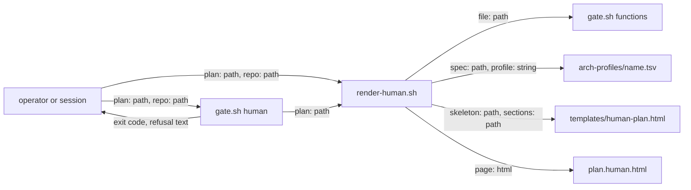

# human-plan-page — architecture spec

## File tree

```text
bin/render-human.sh                  new, renders <plan>.human.html from a plan and its spec
lib/human-render.sh                  new, the markdown-to-page functions
lib/human-check.sh                   new, cmd_human: the page is present, current and linked
templates/human-plan.html            new, page skeleton and styles
templates/human-plan-sections.tsv    new, which plan sections and columns the page shows
commands/_shared/human-plan.md       new, the render and gate contract
bin/gate.sh                          runs main only when executed; gains `human`, called from all --phase approve
lib/arch-check.sh                    skips @ lines in a profile
arch-profiles/code.tsv               gains @review lines
arch-profiles/harness.tsv            gains @review lines
commands/v-team.md                   Step 4 runs gate.sh human
commands/v-team/steps/03-propose-loop.md   (g) renders, publishes and records the page link
vault/plans/2026-09-21-0900-architecture-first-planning.arch.md   gains Diagrams and Operator requests sections
vault/plans/2026-09-21-0900-architecture-first-planning.human.html   regenerated by the renderer
tests/unit/human-plan.bats           new
tests/fixtures/human/plan.md         new, a small plan
tests/fixtures/human/expected.html   new, its page, rendered on the host
```

## Files

| path | new | purpose | loaded |
|------|-----|---------|--------|
| bin/render-human.sh | yes | writes the human page for one plan | on-demand |
| lib/human-render.sh | yes | converts plan and spec sections into page markup | on-demand |
| lib/human-check.sh | yes | checks the page is present, current and linked | on-demand |
| templates/human-plan.html | yes | holds the page skeleton and styles | on-demand |
| templates/human-plan-sections.tsv | yes | lists the plan sections and columns the page shows | on-demand |
| commands/_shared/human-plan.md | yes | states the render rules and the gate | on-demand |
| bin/gate.sh | no | refuses a session that skipped a required step | on-demand |
| lib/arch-check.sh | no | checks an architecture spec against its profile | on-demand |
| arch-profiles/code.tsv | no | lists the sections and rules of the code profile | on-demand |
| arch-profiles/harness.tsv | no | lists the sections and rules of the harness profile | on-demand |
| lib/shared-module-rules.tsv | no | lists the rules each shared module owns | never-by-agent |
| commands/v-team.md | no | dispatcher for the team lifecycle | always |
| commands/v-team/steps/03-propose-loop.md | no | the PROPOSE step of the team lifecycle | on-demand |
| tests/unit/v-team.bats | no | guards the wiring of the team lifecycle | never-by-agent |
| vault/plans/2026-09-21-0900-architecture-first-planning.md | no | the master plan this session belongs to | on-demand |
| vault/plans/2026-09-21-0900-architecture-first-planning.arch.md | no | the master plan's structure spec | on-demand |
| vault/plans/2026-09-21-0900-architecture-first-planning.human.html | no | the master plan's page, regenerated | on-demand |
| vault/decisions/ADR-031-architecture-first-planning.md | no | records the structural decisions | on-demand |
| vault/features/architecture-spec.md | no | the feature dossier for the spec and page | on-demand |
| tests/unit/human-plan.bats | yes | tests the renderer and the gate | never-by-agent |
| tests/fixtures/human/plan.md | yes | a small plan the tests render | never-by-agent |
| tests/fixtures/human/expected.html | yes | the golden page the container test compares against | never-by-agent |

## Data flow



## Interfaces

| interface | method | params | returns | throws | layer |
|-----------|--------|--------|---------|--------|-------|
| render-human.sh | render | plan: path, repo: path, stdout: flag | page file or html on stdout | exit 2 | cli |
| gate.sh | human | plan: path, repo: path | exit code 0, 1 or 2 | - | cli |
| human-render.sh | render_page | plan: path, spec: path, profile: path | html: string | - | function |
| human-render.sh | render_table | section: string, columns: string | html: string | - | function |
| human-render.sh | render_graph | sessions: string | mermaid: string | - | function |
| human-check.sh | cmd_human | plan: path, repo: path | exit code 0, 1 or 2 | - | function |

## Load order

| trigger | loads | tokens-max |
|---------|-------|------------|
| the render runs | commands/_shared/human-plan.md | 1500 |
| the render runs | templates/human-plan.html | 0 |
| the render runs | templates/human-plan-sections.tsv | 0 |
| the render runs | the named profile's .tsv in arch-profiles/ | 0 |

## Reuse map

| need | existing symbol | decision | reason |
|------|-----------------|----------|--------|
| read frontmatter | bin/gate.sh frontmatter_get | reuse | already reads leading frontmatter; the script sources gate.sh |
| find a profile file | lib/arch-check.sh arch_profile_file | reuse | repo first, then framework |
| read a repo key | lib/arch-check.sh vault_key | reuse | returns the raw value |
| split a table into cells for the gate | bin/gate.sh table_rows | reuse | handles escaped pipes; a test feeds one row to it and to the renderer |
| page styles | vault/plans/2026-09-21-0900-architecture-first-planning.human.html | extend | its tokens become the skeleton |
| markdown to html | - | new | searched bin, lib and commands for a converter; none exists |
| split a table into html cells | - | new | table_rows joins cells with a control character for bash; html needs its own output |

## Size budgets

| path | max lines |
|------|-----------|
| bin/render-human.sh | 80 |
| lib/human-render.sh | 340 |
| lib/human-check.sh | 120 |
| templates/human-plan.html | 200 |
| commands/_shared/human-plan.md | 120 |
| bin/gate.sh | 900 |

## Config points

| key | file | default |
|-----|------|---------|
| human_plan | plans/slug.md frontmatter | empty |
| @review | arch-profiles/name.tsv | no checklist |
| section and column list | templates/human-plan-sections.tsv | Task, Open & deferred, Success criteria, Decisions, Cross-session contracts, Sessions |
