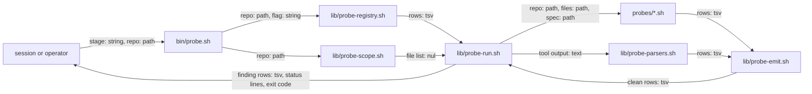

# probe-kit-core — architecture spec

## File tree

```text
bin/probe.sh                          new, argument parsing and dispatch of the five commands
lib/probe-emit.sh                     new, the one place a finding row is built and cleaned
lib/probe-scope.sh                    new, the file list, changed files, scale and hardened git calls
lib/probe-registry.sh                 new, reads, validates and merges registries, detect, tool lookup
lib/probe-run.sh                      new, runs one row with limits and checks its rows
lib/probe-parsers.sh                  new, turns lizard, typos and claude validate output into finding rows
lib/probe-sql.sh                      new, runs the SQL reader and returns its facts
lib/probe-sql.awk                     new, the awk program that reads SQL text into table, column and key facts
probes/registry.tsv                   new, one row per probe and stage
probes/harness.sh                     new, links, unreferenced files, file size
probes/sql-schema.sh                  new, duplicate columns, foreign key indexes, naming
probes/similar-symbols.sh             new, existing symbols that overlap a planned one
commands/_shared/probe-kit.md         new, the contract of the kit
lib/shared-module-rules.tsv           gains one owned-rule row
vault/research/probe-tool-verification.md   new, the verdict on each tool claim
tests/unit/probe.bats                 new
tests/fixtures/probe/                 new, captured tool outputs and two schemas
checks/probe-SC-1.sh to probe-SC-11.sh   new, decide the eleven criteria
```

## Files

| path | new | purpose | loaded |
|------|-----|---------|--------|
| bin/probe.sh | yes | runs, lists and sizes the probes of a repo | on-demand |
| lib/probe-emit.sh | yes | builds and cleans a finding row and parses probe options | on-demand |
| lib/probe-scope.sh | yes | lists files, changed files and repo size, and runs git safely | on-demand |
| lib/probe-registry.sh | yes | reads, validates and merges registries and detects stacks | on-demand |
| lib/probe-run.sh | yes | runs one registry row inside its limits and evaluates detect cells | on-demand |
| lib/probe-parsers.sh | yes | converts tool output into finding rows | on-demand |
| lib/probe-sql.sh | yes | runs the SQL reader on one file | on-demand |
| lib/probe-sql.awk | yes | extracts tables, columns and keys from SQL text | on-demand |
| probes/registry.tsv | yes | lists every probe with its stage, cost and install command | on-demand |
| probes/harness.sh | yes | checks links, references and size of instruction files | on-demand |
| probes/sql-schema.sh | yes | checks a SQL schema for duplicate columns, unindexed keys and bad names | on-demand |
| probes/similar-symbols.sh | yes | finds existing functions whose names overlap a planned one | on-demand |
| commands/_shared/probe-kit.md | yes | states the registry, finding row, commands and exit codes | on-demand |
| lib/shared-module-rules.tsv | no | lists the rules each shared module owns | never-by-agent |
| vault/research/probe-tool-verification.md | yes | records what each tool claim turned out to be | on-demand |
| vault/decisions/ADR-031-architecture-first-planning.md | no | records the structural decisions | on-demand |
| vault/plans/2026-09-21-0900-architecture-first-planning.md | no | the master plan this session belongs to | on-demand |
| vault/features/architecture-spec.md | no | the feature dossier for the spec and probes | on-demand |
| tests/unit/probe.bats | yes | tests the kit in the container | never-by-agent |
| tests/fixtures/probe/lizard.csv | yes | a captured lizard output | never-by-agent |
| tests/fixtures/probe/typos.jsonl | yes | a captured typos output | never-by-agent |
| tests/fixtures/probe/claude-validate.json | yes | a captured plugin validate output | never-by-agent |
| tests/fixtures/probe/schema-bad.sql | yes | a schema with one defect of each kind | never-by-agent |
| tests/fixtures/probe/schema-clean.sql | yes | a schema with no defect | never-by-agent |
| checks/probe-SC-1.sh | yes | decides success criterion SC-1 | never-by-agent |
| checks/probe-SC-2.sh | yes | decides success criterion SC-2 | never-by-agent |
| checks/probe-SC-3.sh | yes | decides success criterion SC-3 | never-by-agent |
| checks/probe-SC-4.sh | yes | decides success criterion SC-4 | never-by-agent |
| checks/probe-SC-5.sh | yes | decides success criterion SC-5 | never-by-agent |
| checks/probe-SC-6.sh | yes | decides success criterion SC-6 | never-by-agent |
| checks/probe-SC-7.sh | yes | decides success criterion SC-7 | never-by-agent |
| checks/probe-SC-8.sh | yes | decides success criterion SC-8 | never-by-agent |
| checks/probe-SC-9.sh | yes | decides success criterion SC-9 | never-by-agent |
| checks/probe-SC-10.sh | yes | decides success criterion SC-10 | never-by-agent |
| checks/probe-SC-11.sh | yes | decides success criterion SC-11 | never-by-agent |

## Data flow



## Interfaces

| interface | method | params | returns | throws | layer |
|-----------|--------|--------|---------|--------|-------|
| probe.sh | list | repo: path | one line per row, ok or absent | exit 2 | cli |
| probe.sh | detect | repo: path | probe ids whose stack is present | exit 2 | cli |
| probe.sh | run | stage: string, repo: path, spec: path, max_cost: string, no_repo_code: flag, allow_repo_registry: flag, only: string | finding rows and exit code 0, 1 or 2 | exit 2 | cli |
| probe.sh | diff | repo: path, base: string | finding rows in changed files | exit 2 | cli |
| probe.sh | scale | repo: path | files, lines and max-cost lines | exit 2 | cli |
| probe-registry.sh | probe_registry | repo: path, allow: int | registry lines with an origin column | exit 2 | function |
| probe-registry.sh | probe_tool_present | run: string, trust: string, repo: path | exit code 0 or 1 | - | function |
| probe-run.sh | probe_detect | cell: string, trust: string, repo: path | exit code 0 or 1 | - | function |
| probe-run.sh | probe_run_row | origin: string, id: string, stack: string, stage: string, detect: string, run: string, parser: string, cost: string, trust: string, install: string | finding rows on stdout | status line | function |
| probe-run.sh | probe_exec | cwd: path, trust: string, cell: string, out: path, err: path | PROBE_RC | - | function |
| probe-run.sh | probe_abort | - | - | - | function |
| probe-scope.sh | probe_files | repo: path, out: path | NUL-separated regular files | - | function |
| probe-scope.sh | probe_changed | repo: path, base: string, out: path | NUL-separated changed and untracked files | exit code 2 | function |
| probe-scope.sh | probe_scale | repo: path, list: path | files, lines and max-cost lines | - | function |
| probe-scope.sh | probe_git | repo: path, args: string | git output | - | function |
| probe-scope.sh | probe_safe_file | repo: path, rel: string | exit code 0 or 1 | - | function |
| probe-scope.sh | probe_normalize | rel: string | normalized path | exit code 1 | function |
| probe-emit.sh | probe_finding | probe: string, file: path, line: int, severity: string, rule: string, message: string | one clean six-field row | - | function |
| probe-emit.sh | probe_sanitize | text: string | text without control bytes | - | function |
| probe-emit.sh | probe_args | argv: string | option variables set | exit 2 | function |
| probe-emit.sh | probe_native_init | argv: string | repo, TMP and LIST set | exit 2 | function |
| probe-emit.sh | probe_emit_sorted | check: string | sorted finding rows from stdin | exit code 1 | function |
| probe-parsers.sh | parse_lizard_csv | id: string, repo: path | finding rows read from stdin | - | function |
| probe-parsers.sh | parse_typos_json | id: string, repo: path | finding rows read from stdin | exit code 3 | function |
| probe-parsers.sh | parse_claude_validate | id: string, repo: path | finding rows read from stdin | exit code 3 | function |
| probe-sql.sh | sql_facts | label: string, path: path | T, C and K fact lines | - | function |
| harness.sh | check | name: string, repo: path | finding rows | exit 2 | cli |
| sql-schema.sh | check | name: string, repo: path | finding rows | exit 2 | cli |
| similar-symbols.sh | check | repo: path, spec: path, names: string | finding rows | exit 2 | cli |

## Load order

| trigger | loads | tokens-max |
|---------|-------|------------|
| a session adds a probe row or reads a finding | commands/_shared/probe-kit.md | 1500 |
| bin/probe.sh runs | lib/probe-emit.sh, lib/probe-scope.sh, lib/probe-registry.sh, lib/probe-run.sh | 0 |
| a registry row names a parser | lib/probe-parsers.sh | 0 |
| a schema probe runs | lib/probe-sql.sh | 0 |

## Reuse map

| need | existing symbol | decision | reason |
|------|-----------------|----------|--------|
| read the rows of a spec table | bin/gate.sh table_rows | new | sourcing gate.sh brings `set -e`, the `gate:` message prefix and global variables into each probe; a 15-line awk reads two columns of one table |
| find the framework root | lib/arch-check.sh arch_profile_file | new | it returns the first hit, and the registry needs the framework file and the repo file together |
| argument parsing with --repo | bin/render-human.sh | new | the parser there is inline; native probes run as separate processes, so `probe_args` in lib/probe-emit.sh is shared by them and by bin/probe.sh |
| list changed and untracked files | bin/release-check.sh line 78 | new | searched bin and lib; two scripts each hold a private copy tied to their own output, so a hardened shared function is written once here |
| a registry of checks with a cost column | quality/checks.tsv of the vault-quality-gates plugin | new | it runs at push time against a baseline; this registry runs while a session plans; ADR-031 rejects sharing it |
| link checking | - | new | searched bin, lib and scripts for a link resolver; only doc-lint's DUP1 exists and it checks repeated lines |
| SQL text parsing | - | new | searched bin and lib for a SQL reader; none exists |
| symbol name extraction | - | new | a regex reads the source with no install |
| complexity, spelling and manifest checks | - | new | wrappers for lizard, typos and claude plugin validate; none exists |
| timeouts | - | new | searched bin, lib and scripts for `timeout`; none exists |

## Size budgets

| path | max lines |
|------|-----------|
| bin/probe.sh | 140 |
| lib/probe-emit.sh | 90 |
| lib/probe-scope.sh | 140 |
| lib/probe-registry.sh | 160 |
| lib/probe-run.sh | 220 |
| lib/probe-parsers.sh | 160 |
| lib/probe-sql.sh | 30 |
| lib/probe-sql.awk | 130 |
| probes/harness.sh | 260 |
| probes/sql-schema.sh | 200 |
| probes/similar-symbols.sh | 200 |
| commands/_shared/probe-kit.md | 150 |

## Config points

| key | file | default |
|-----|------|---------|
| PROBE_TIMEOUT | environment | 120 |
| PROBE_SCALE_L | environment | 2000 |
| PROBE_SCALE_M | environment | 10000 |
| PROBE_TOKEN_MAX | environment | 6000 |
| PROBE_OUT_MAX | environment | 5000000 |
| PROBE_FILE_MAX | environment | 2097152 |
| PROBE_NLOC | environment | 60 |
| PROBE_PARAMS | environment | 5 |
| PROBE_CCN | environment | 10 |
| PROBE_DEAD_DIRS | environment | commands lib bin templates personas arch-profiles hooks scripts checks |
| PROBE_SQL | environment | discovered under database, migrations, db and schema |
| glossary, columns banned and preferred | probes/glossary.tsv of the repo | no glossary findings |
| registry | probes/registry.tsv of the repo | no repo rows |
