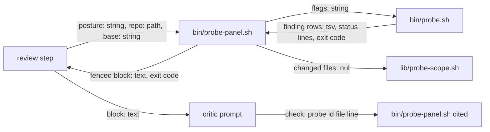

# probe-panel-input — architecture spec

## File tree

```text
bin/probe-panel.sh                       new, runs the probe stage for a review and prints one data block
commands/_shared/critic-panel.md         existing, gains the probe stage rules
commands/v-team/steps/04-execute-loop.md existing, runs the stage each round
commands/v-cr/steps/03-review.md         existing, runs the stage once
commands/v-work/steps/04-execute.md      existing, runs the stage before review
commands/_shared/probe-kit.md            existing, Trust section points to the panel module
templates/indication.md                  existing, gains the probe key
bin/indication-route-audit.sh            existing, checks the probe key
tests/unit/probe-panel.bats              new
checks/probe-panel-SC-1.sh to probe-panel-SC-7.sh   new, decide the seven criteria
```

## Files

| path | new | purpose | loaded |
|------|-----|---------|--------|
| bin/probe-panel.sh | yes | runs bin/probe.sh diff and prints the fenced block a critic receives | on-demand |
| bin/probe.sh | no | runs the probes and prints finding rows | on-demand |
| lib/probe-scope.sh | no | lists changed files with hardened git calls | on-demand |
| commands/_shared/critic-panel.md | no | states the panel procedure and the probe stage rules | on-demand |
| commands/v-team/steps/04-execute-loop.md | no | states the v-team review loop | on-demand |
| commands/v-cr/steps/03-review.md | no | states the v-cr review step | on-demand |
| commands/v-work/steps/04-execute.md | no | states the v-work execute step | on-demand |
| commands/_shared/probe-kit.md | no | states the kit contract | on-demand |
| templates/indication.md | no | starting text of an indication | on-demand |
| bin/indication-route-audit.sh | no | reports indications a review cannot reach or that name an unknown probe | on-demand |
| tests/unit/probe-panel.bats | yes | tests the helper and the text guards | never-by-agent |
| checks/probe-panel-SC-1.sh | yes | decides criterion SC-1 | never-by-agent |
| checks/probe-panel-SC-2.sh | yes | decides criterion SC-2 | never-by-agent |
| checks/probe-panel-SC-3.sh | yes | decides criterion SC-3 | never-by-agent |
| checks/probe-panel-SC-4.sh | yes | decides criterion SC-4 | never-by-agent |
| checks/probe-panel-SC-5.sh | yes | decides criterion SC-5 | never-by-agent |
| checks/probe-panel-SC-6.sh | yes | decides criterion SC-6 | never-by-agent |
| checks/probe-panel-SC-7.sh | yes | decides criterion SC-7 | never-by-agent |

## Data flow



## Interfaces

| interface | method | params | returns | throws | layer |
|-----------|--------|--------|---------|--------|-------|
| probe-panel.sh | run | posture: string, repo: path, base: string, out: path, paths: path | the fenced block, operator.txt when incomplete, exit code 0 or 2 | exit 2 | cli |
| probe-panel.sh | cited | out: path, probe: string, file: path, line: int | confirmed or advisory with exit 0, none with exit 1 | exit 2 | cli |
| indication-route-audit.sh | audit | index: path, changed: path, repo: path | unroutable, unknown-probe and unchecked-probe lines, exit 0 or 1 | exit 2 | cli |

## Load order

| trigger | loads | tokens-max |
|---------|-------|------------|
| a critic panel starts | commands/_shared/critic-panel.md | 3000 |
| a review round starts | bin/probe-panel.sh | 0 |
| a critic prompt is built | the probe block | 3000 |

## Reuse map

| need | existing symbol | decision | reason |
|------|-----------------|----------|--------|
| run the probes on a diff | bin/probe.sh | reuse | the helper calls `bin/probe.sh diff` and adds no probe logic |
| list changed and untracked files hardened | lib/probe-scope.sh probe_changed | reuse | it already runs git with the repo config switched off |
| read the origin of a registry id | bin/probe.sh list | reuse | the origin column says framework or repo; the helper reads it with and without the repo registry and treats an id defined by both as advisory |
| the mechanics of ground first | commands/_shared/critic-panel.md | extend | §(a) gains the probe stage; the three commands reuse it |
| fence untrusted text in a prompt | commands/_shared/critic-panel.md | reuse | the untrusted-input contract states the delimiter rule; the helper prints its own fence for the rows |
| sort, cap and fence rows | - | new | searched bin and lib for a row limiter and a delimiter neutraliser; none exists, because the kit prints every row |
| read a frontmatter key of an indication | lib/cr-helpers.sh | new | searched lib and bin for a frontmatter reader; `cr_rule_route` reads index cells only and `gate.sh frontmatter_get` cannot be sourced without its `set -e`, so a six-line awk reads one key |

## Size budgets

| path | max lines |
|------|-----------|
| bin/probe-panel.sh | 140 |
| commands/_shared/critic-panel.md | 230 |
| commands/_shared/probe-kit.md | 150 |
| bin/indication-route-audit.sh | 130 |

## Config points

| key | file | default |
|-----|------|---------|
| PROBE_PANEL_ROWS | environment | 40 |
| PROBE_PANEL_BYTES | environment | 12000 |
| PROBE_PANEL_REPO_CODE | environment | unset |
