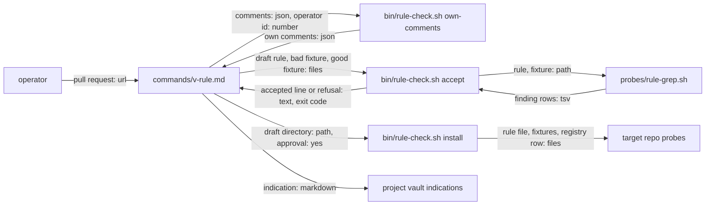

# v-rule — architecture spec

## File tree

```text
commands/v-rule.md                       new, the skill: comments in, rule out
bin/rule-check.sh                        new, accepts, installs and verifies a rule, filters comments
probes/rule-grep.sh                      new, the framework's runner for a declarative rule file
commands/_shared/probe-kit.md            existing, gains the Rule files section
templates/indication.md                  existing, gains probe_count and source
README.md                                existing, gains one command row
tests/unit/rule.bats                     new
checks/rule-SC-1.sh to rule-SC-8.sh      new, decide the eight criteria
```

## Files

| path | new | purpose | loaded |
|------|-----|---------|--------|
| commands/v-rule.md | yes | steps of the review-to-rule skill | on-demand |
| bin/rule-check.sh | yes | decides accept, installs the rule files, reads a probe key back, filters comments by user id | on-demand |
| probes/rule-grep.sh | yes | runs one declarative rule file and prints finding rows | on-demand |
| commands/_shared/probe-kit.md | no | states the kit contract and the rule-file format | on-demand |
| templates/indication.md | no | starting text of an indication | on-demand |
| README.md | no | lists the commands | on-demand |
| tests/unit/rule.bats | yes | tests the runner, the checker and the text guards | never-by-agent |
| checks/rule-SC-1.sh | yes | decides criterion SC-1 | never-by-agent |
| checks/rule-SC-2.sh | yes | decides criterion SC-2 | never-by-agent |
| checks/rule-SC-3.sh | yes | decides criterion SC-3 | never-by-agent |
| checks/rule-SC-4.sh | yes | decides criterion SC-4 | never-by-agent |
| checks/rule-SC-5.sh | yes | decides criterion SC-5 | never-by-agent |
| checks/rule-SC-6.sh | yes | decides criterion SC-6 | never-by-agent |
| checks/rule-SC-7.sh | yes | decides criterion SC-7 | never-by-agent |
| checks/rule-SC-8.sh | yes | decides criterion SC-8 | never-by-agent |

## Data flow



## Interfaces

| interface | method | params | returns | throws | layer |
|-----------|--------|--------|---------|--------|-------|
| rule-check.sh | own-comments | operator_id: int | the comments of that user id as JSON | exit 2 | cli |
| rule-check.sh | accept | repo: path, slug: string, rule: path, bad: path, good: path | `accepted <slug>: <n> of <files> files at <sha>` or a refusal, exit 0 or 1 | exit 2 | cli |
| rule-check.sh | install | repo: path, slug: string, draft: path, stack: string | written paths and the record line, exit 0 or 1 | exit 2 | cli |
| rule-check.sh | verify | repo: path, slug: string, indication: path | one status line, exit 0 or 1 | exit 2 | cli |
| rule-check.sh | row | slug: string, stack: string | the template registry row | exit 2 | cli |
| rule-grep.sh | run | check: string, rule: path, repo: path, fixture: path, count_files: bool | finding rows, exit 0 or 1 | exit 2 | cli |

## Load order

| trigger | loads | tokens-max |
|---------|-------|------------|
| the operator calls `/v-rule` | commands/v-rule.md | 3000 |
| the skill drafts a rule | commands/_shared/probe-kit.md | 3000 |
| the skill checks a draft | bin/rule-check.sh | 0 |

## Reuse map

| need | existing symbol | decision | reason |
|------|-----------------|----------|--------|
| print a finding row | lib/probe-emit.sh probe_finding | reuse | the runner builds rows with it, as every native probe does |
| start a native probe | lib/probe-emit.sh probe_native_init | reuse | it parses `--check`, `--repo` and the file list |
| list the files a probe may read | lib/probe-scope.sh probe_files | reuse | it drops symlinks and control-byte names |
| refuse a symlinked registry | lib/probe-scope.sh probe_safe_file | reuse | it checks a regular file inside the repo |
| count the files of a repo | bin/probe.sh scale | reuse | it prints the file count the panel already uses |
| run a rule through the kit | bin/probe.sh run plan | reuse | `verify` proves the wiring with the same call a review makes |
| check a `probe:` id against registries | bin/indication-route-audit.sh | reuse | `verify` prints the same orphan the audit reports |
| read a frontmatter key | - | new | searched lib and bin: `gate.sh frontmatter_get` cannot be sourced without its `set -e` and `lib/cr-helpers.sh` reads index cells only, so a short awk reads one key |
| filter comments by user id | - | new | searched lib and bin for a comment filter; `cr_rule_route` routes rules and reads no comment |

## Size budgets

| path | max lines |
|------|-----------|
| bin/rule-check.sh | 200 |
| probes/rule-grep.sh | 120 |
| commands/v-rule.md | 130 |
| commands/_shared/probe-kit.md | 150 |

## Config points

| key | file | default |
|-----|------|---------|
| RULE_MAX_FINDINGS | environment | half of PROBE_PANEL_ROWS |
| PROBE_RULE_TIMEOUT | environment | 10 |
