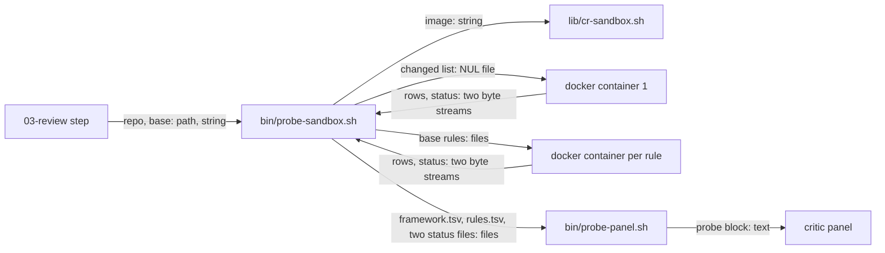

# sandbox-probe — architecture spec

## File tree

```text
bin/probe-sandbox.sh                       new, the host driver: builds the mounts, runs the containers, writes the four files
bin/probe.sh                               existing, gains --changed-list and the PROBE_TOOLS_FROM check
bin/probe-panel.sh                         existing, gains --posture sandbox and --rows-from
lib/probe-registry.sh                      existing, probe_path honours PROBE_TOOLS_FROM=image
lib/cr-sandbox.sh                          existing, gains cr_sandbox_map_get and cr_probe_image; probe-image is an envelope key
commands/v-cr/sandbox.md                   existing, gains section S8, the probe stage
commands/v-cr/steps/02-gather.md           existing, §2.6 runs bin/probe-sandbox.sh
commands/v-cr/steps/03-review.md           existing, the probe block and the Probes line
commands/_shared/probe-kit.md              existing, documents --changed-list and PROBE_TOOLS_FROM
commands/_shared/critic-panel.md           existing, one sentence for the sandbox posture
vault/decisions/ADR-009-v-cr-sandboxed-execution.md   existing, gains an addendum
tests/unit/sandbox-probe.bats              new
tests/unit/cr-sandbox.bats                 existing, gains cases
tests/unit/v-cr.bats                       existing, gains and edits guards
tests/fixtures/sandbox-probe/              new, a docker test double and a fixture repo builder
checks/sandbox-probe-SC-1.sh to SC-7.sh    new, decide the seven criteria
```

## Files

| path | new | purpose | loaded |
|------|-----|---------|--------|
| bin/probe-sandbox.sh | yes | runs the framework and template probes in containers and writes the four files | on-demand |
| bin/probe.sh | no | runs probes; reads a changed-file list without git | on-demand |
| bin/probe-panel.sh | no | prints the probe block for the critics | on-demand |
| lib/probe-registry.sh | no | reads registries and finds each row's tool | on-demand |
| lib/cr-sandbox.sh | no | pure helpers of the sandbox path | on-demand |
| commands/v-cr/sandbox.md | no | contract of the sandbox path | on-demand |
| commands/v-cr/steps/02-gather.md | no | gather step of a review | on-demand |
| commands/v-cr/steps/03-review.md | no | review step of a review | on-demand |
| commands/_shared/probe-kit.md | no | contract of the probe kit | on-demand |
| commands/_shared/critic-panel.md | no | contract of the critic panel | always |
| vault/decisions/ADR-009-v-cr-sandboxed-execution.md | no | decision record of the sandbox path | on-demand |
| tests/unit/sandbox-probe.bats | yes | runs the graders and text guards | never-by-agent |
| tests/unit/cr-sandbox.bats | no | tests the pure sandbox helpers | never-by-agent |
| tests/unit/v-cr.bats | no | guards the text of the review command | never-by-agent |
| tests/fixtures/sandbox-probe/fake-docker.sh | yes | test double of docker | never-by-agent |
| tests/fixtures/sandbox-probe/mk-repo.sh | yes | builds the fixture repo | never-by-agent |
| checks/sandbox-probe-SC-1.sh | yes | decides criterion SC-1 | never-by-agent |
| checks/sandbox-probe-SC-2.sh | yes | decides criterion SC-2 | never-by-agent |
| checks/sandbox-probe-SC-3.sh | yes | decides criterion SC-3 | never-by-agent |
| checks/sandbox-probe-SC-4.sh | yes | decides criterion SC-4 | never-by-agent |
| checks/sandbox-probe-SC-5.sh | yes | decides criterion SC-5 | never-by-agent |
| checks/sandbox-probe-SC-6.sh | yes | decides criterion SC-6 | never-by-agent |
| checks/sandbox-probe-SC-7.sh | yes | decides criterion SC-7 | never-by-agent |

## Data flow



## Interfaces

| interface | method | params | returns | throws | layer |
|-----------|--------|--------|---------|--------|-------|
| probe-sandbox.sh | run | repo: path, base: string, sandbox_name: string, out: path | four files in out; exit 0 ran, 3 not started | exit 2 | cli |
| probe.sh | diff | repo: path, changed_list: path, only: string, allow_repo_registry: bool | finding rows on stdout and status lines on stderr | exit 2 | cli |
| probe-panel.sh | run | posture: string, repo: path, base: string, rows_from: path, out: path, paths: path | probe block; exit 0 complete, 2 incomplete | exit 2 | cli |
| cr-sandbox.sh | cr_sandbox_map_get | key: string | the value of the first key in VCR_SANDBOX_MAP | rc 1 | lib |
| cr-sandbox.sh | cr_probe_image | - | the probe image name | rc 1 | lib |

## Load order

| trigger | loads | tokens-max |
|---------|-------|------------|
| a review runs with --sandbox | commands/v-cr/sandbox.md | 4000 |
| step 2.6 provisions the sandbox | commands/v-cr/steps/02-gather.md | 3000 |
| step 3.1 runs the probe block | commands/v-cr/steps/03-review.md | 3500 |
| a critic panel starts | commands/_shared/critic-panel.md | 4000 |
| the probe stage runs | bin/probe-sandbox.sh | 0 |

## Reuse map

| need | existing symbol | decision | reason |
|------|-----------------|----------|--------|
| the sandbox root and the teardown path guard | lib/cr-sandbox.sh cr_sandbox_root, cr_sandbox_path_is_safe | reuse | the work directory is a child of the root and is removed only after the guard |
| scrub secrets from a stream | lib/cr-sandbox.sh cr_redact_runtime | reuse | contract C-8 names it |
| check and rewrite finding rows | lib/probe-run.sh probe_check_rows | reuse | it enforces six fields and a safe file; the host calls it once per id |
| list the files a probe may read | lib/probe-scope.sh probe_files | reuse | the host copies exactly these files into the mount |
| list the changed files | lib/probe-scope.sh probe_changed | reuse | the host writes the list the container reads |
| read a git object without filters | lib/probe-scope.sh probe_git | reuse | it switches off hooks, attributes and filters |
| the template registry row | bin/rule-check.sh row | reuse | the host compares each base row with it |
| read a value of VCR_SANDBOX_MAP | - | new | searched lib and commands for VCR_SANDBOX_MAP; only prose names it |
| run a command in a container | - | new | searched bin and lib for docker run; only tests/run.sh runs docker, for the unit suite, and it applies no envelope |
| the PATH of a cell | lib/probe-registry.sh probe_path | extend | one condition keeps the repo directories out under PROBE_TOOLS_FROM=image |

## Size budgets

| path | max lines |
|------|-----------|
| bin/probe-sandbox.sh | 300 |
| bin/probe.sh | 165 |
| bin/probe-panel.sh | 250 |
| lib/cr-sandbox.sh | 245 |
| commands/v-cr/sandbox.md | 235 |
| commands/_shared/probe-kit.md | 150 |

## Config points

| key | file | default |
|-----|------|---------|
| probe-image | VCR_SANDBOX_MAP | none, the stage does not start |
| memory | VCR_SANDBOX_MAP | 1g |
| cpus | VCR_SANDBOX_MAP | 1 |
| pids | VCR_SANDBOX_MAP | 256 |
| PROBE_SANDBOX_TIMEOUT | environment | 180 seconds per container |
| PROBE_SANDBOX_RULES_MAX | environment | 20 template rows |
| PROBE_SANDBOX_FILES_MAX | environment | 20000 files |
| PROBE_SANDBOX_BYTES_MAX | environment | 200000000 bytes |
| PROBE_SANDBOX_TOTAL | environment | 900 seconds for all containers |
| PROBE_SANDBOX_DOCKER | environment | docker |
| PROBE_TOOLS_FROM | environment | unset; image keeps repo tool directories out of PATH |
