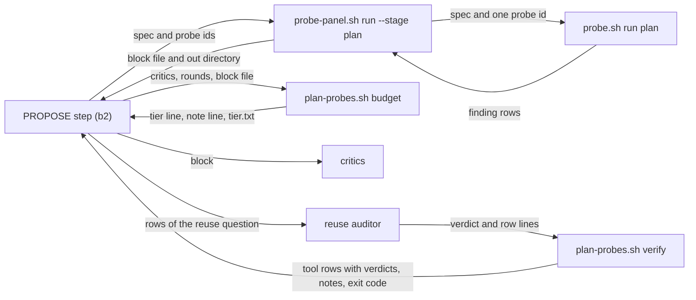

# plan-time-probes — architecture spec

## File tree

```text
bin/plan-probes.sh                                     new, the stage's script: budget, verify, measure, probes, auditors
bin/probe-panel.sh                                     existing, gains --stage plan, --spec and repeatable --only; --posture and --base are not used with it
probes/similar-symbols.sh                              existing, gains the check spec-symbols and the stopwords in on by at from
probes/registry.tsv                                    existing, gains one row for spec-symbols
commands/_shared/plan-probes.md                        new, owns the stage rules, the auditor questions and the gate notes
commands/v-team/steps/03-propose-loop.md               existing, gains step (b2) and one envelope bullet
commands/_shared/probe-kit.md                          existing, documents --stage plan and the spec-symbols rule
tests/unit/plan-probes.bats                            new
lib/shared-module-rules.tsv                            existing, gains one owned-rule row for plan-probes.md
vault/plans/2026-09-21-0900-architecture-first-planning.md   existing, S5 row done, S11 row added
checks/plan-probe-SC-1.sh to SC-7.sh                   new, decide the seven criteria
```

## Files

| path | new | purpose | loaded |
|------|-----|---------|--------|
| bin/plan-probes.sh | yes | decides the stage tier, verifies auditor rows, measures tokens, lists the stage's probes and auditors | on-demand |
| bin/probe-panel.sh | no | prints the probe block for the critics | on-demand |
| probes/similar-symbols.sh | no | compares a spec's Reuse map with the code | on-demand |
| probes/registry.tsv | no | lists every probe with its stage and cost | on-demand |
| commands/_shared/plan-probes.md | yes | contract of the plan-time stage | on-demand |
| commands/v-team/steps/03-propose-loop.md | no | PROPOSE step of a team run | always |
| commands/_shared/probe-kit.md | no | contract of the probe kit | on-demand |
| lib/shared-module-rules.tsv | no | lists the rules each shared module owns | on-demand |
| tests/unit/plan-probes.bats | yes | runs the graders and guards the new text | never-by-agent |
| vault/plans/2026-09-21-0900-architecture-first-planning.md | no | master plan and session tracker | on-demand |
| checks/plan-probe-SC-1.sh | yes | decides criterion SC-1 | never-by-agent |
| checks/plan-probe-SC-2.sh | yes | decides criterion SC-2 | never-by-agent |
| checks/plan-probe-SC-3.sh | yes | decides criterion SC-3 | never-by-agent |
| checks/plan-probe-SC-4.sh | yes | decides criterion SC-4 | never-by-agent |
| checks/plan-probe-SC-5.sh | yes | decides criterion SC-5 | never-by-agent |
| checks/plan-probe-SC-6.sh | yes | decides criterion SC-6 | never-by-agent |
| checks/plan-probe-SC-7.sh | yes | decides criterion SC-7 | never-by-agent |

## Data flow



## Interfaces

| interface | method | params | returns | throws | layer |
|-----------|--------|--------|---------|--------|-------|
| bin/plan-probes.sh | budget | critics: int, rounds: int, block: path, out: path | tier line, a note line unless the tier is full, and out/tier.txt, exit 0 | exit 2 on a bad number or an unreadable block | cli |
| bin/plan-probes.sh | verify | out: path, rows: path | the block's own copy of each kept row with its verdict, open and note lines, exit 0 or 1 | exit 2 on an unreadable directory or a missing out/tier.txt | cli |
| bin/plan-probes.sh | measure | transcript: path, from: string, to: string | one line per file and a total, exit 0 | exit 2 on an unreadable transcript | cli |
| bin/plan-probes.sh | probes | - | the plan-time probe ids, one per line | - | cli |
| bin/plan-probes.sh | auditors | - | auditor id and probe ids, tab separated | - | cli |
| bin/probe-panel.sh | run | stage: string, spec: path, only: string, repo: path, out: path | the probe block, exit 0 or 2 | exit 2 on a bad option | cli |
| probes/similar-symbols.sh | --check | check: string, repo: path, spec: path | finding rows, exit 0, 1 or 2 | exit 2 on a bad option | cli |

## Load order

| trigger | loads | tokens-max |
|---------|-------|------------|
| PROPOSE step (b2) starts | commands/_shared/plan-probes.md | 1800 |
| the stage runs | the probe block | 3000 |
| the reuse auditor starts | its envelope: the spec, its question and the block rows | 4000 |

## Reuse map

| need | existing symbol | decision | reason |
|------|-----------------|----------|--------|
| print the probe block for critics | bin/probe-panel.sh run | extend | gains --stage plan; a second printer would fork the block format |
| tag rows confirmed or advisory | bin/probe-panel.sh run | reuse | the same tagging, row cap and byte cap apply |
| confirm that an auditor row is in the block | bin/probe-panel.sh cited | extend | cited matches three fields, so verify reads the block's confirmed.tsv and advisory.tsv and compares the whole row |
| run one probe against a spec | bin/probe.sh run | reuse | run plan --only <id> --spec already exists |
| read a spec's Reuse map | probes/similar-symbols.sh | extend | spec-symbols reads the same table; a second reader would be one more table reader beside gate.sh, arch-check.sh, the renderer and similar-symbols |
| check that a Reuse-map row names code that exists | lib/arch-check.sh reuse-decision | extend | the gate checks the form of the row and stays form-only by design; existence in code is a probe check, so the gate gains no rule |
| project the token cost of a stage | - | new | searched bin, lib and scripts for tokens, cost and budget; only bin/probe.sh scale counts files and bin/rule-count.sh counts rule lines |
| sum tokens in a session transcript | - | new | searched bin, lib, scripts, checks and tests for cache_creation and output_tokens; no file reads a transcript |

## Size budgets

| path | max lines |
|------|-----------|
| bin/plan-probes.sh | 260 |
| commands/_shared/plan-probes.md | 120 |
| tests/unit/plan-probes.bats | 220 |

## Config points

| key | file | default |
|-----|------|---------|
| PLAN_PROBE_LIMIT_PERCENT | bin/plan-probes.sh | 50 |
| PLAN_PROBE_BASE_TOKENS | bin/plan-probes.sh | 390000 |
| PLAN_PROBE_CRITIC_TOKENS | bin/plan-probes.sh | 140000 |
| PLAN_PROBE_AUDITOR_TOKENS | bin/plan-probes.sh | 36000 |
| PLAN_PROBE_BYTES_PER_TOKEN | bin/plan-probes.sh | 4 |
