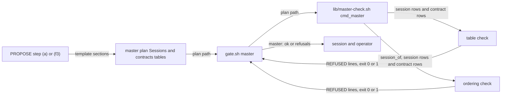

# cross-session-contracts — architecture spec

## File tree

```text
lib/master-check.sh                                    new, cmd_master: the table check and the ordering check
bin/gate.sh                                            existing, sources the library, routes master, calls it in propose and approve
templates/master-plan.md                               new, the Sessions and Cross-session contracts sections of a master plan
templates/plan.md                                      existing, gains the session_of key
commands/v-team/steps/03-propose-loop.md               existing, gains lines in (a), (f3) and (g)
commands/v-team.md                                     existing, Step 4 runs the gate
vault/check-budget.md                                  existing, gains the master row
vault/plans/2026-09-21-0900-architecture-first-planning.md   existing, repaired tables, S6 done, S12 added, E-3 HALF-BUILT
tests/fixtures/master/complete.md                      new, a complete master plan
tests/fixtures/master/session-plan.md                  new, a session plan naming session_of
tests/fixtures/human/plan.md                           existing, gains a contracts table so its Sessions table stays valid
vault/plans/2026-09-21-0900-architecture-first-planning.human.html   existing, re-rendered from the repaired master plan
tests/unit/gate.bats                                   existing, master cases
tests/unit/v-team.bats                                 existing, guards the step text
checks/master-SC-1.sh to SC-5.sh                       new, decide the five criteria
```

## Files

| path | new | purpose | loaded |
|------|-----|---------|--------|
| lib/master-check.sh | yes | checks a master plan's contracts and a session plan's ordering | on-demand |
| bin/gate.sh | no | routes the gate subcommands | on-demand |
| templates/master-plan.md | yes | source of the two master-plan sections | on-demand |
| templates/plan.md | no | source of every plan | on-demand |
| commands/v-team/steps/03-propose-loop.md | no | PROPOSE step of a team run | always |
| commands/v-team.md | no | dispatcher of a team run | always |
| vault/check-budget.md | no | lists every gate check with its wrong-fire budget | on-demand |
| vault/plans/2026-09-21-0900-architecture-first-planning.md | no | master plan and session tracker | on-demand |
| tests/fixtures/master/complete.md | yes | fixture master plan | never-by-agent |
| tests/fixtures/master/session-plan.md | yes | fixture session plan | never-by-agent |
| tests/fixtures/human/plan.md | no | fixture plan of the human page tests | never-by-agent |
| vault/plans/2026-09-21-0900-architecture-first-planning.human.html | no | rendered page of the master plan | never-by-agent |
| tests/unit/gate.bats | no | tests the gate | never-by-agent |
| tests/unit/v-team.bats | no | guards command text | never-by-agent |
| checks/master-SC-1.sh | yes | decides criterion SC-1 | never-by-agent |
| checks/master-SC-2.sh | yes | decides criterion SC-2 | never-by-agent |
| checks/master-SC-3.sh | yes | decides criterion SC-3 | never-by-agent |
| checks/master-SC-4.sh | yes | decides criterion SC-4 | never-by-agent |
| checks/master-SC-5.sh | yes | decides criterion SC-5 | never-by-agent |

## Data flow



## Interfaces

| interface | method | params | returns | throws | layer |
|-----------|--------|--------|---------|--------|-------|
| bin/gate.sh | master | plan: path | master: ok line and exit 0, or REFUSED lines and exit 1, or silence and exit 0 for an ordinary plan | exit 2 on an unreadable plan or master file | cli |
| bin/gate.sh | all | plan: path, phase: string | runs master after arch in propose and approve | exit 2 on a bad option | cli |
| lib/master-check.sh | cmd_master | plan: path | the same lines as gate.sh master; takes no --repo | exit 2 through die when the plan is unreadable | cli |
| lib/master-check.sh | master_refuse | plan: path, problem: string, row: string | one REFUSED master line on standard error, one violation counted | - | cli |

## Load order

| trigger | loads | tokens-max |
|---------|-------|------------|
| PROPOSE step (a) scope splits into sessions | templates/master-plan.md | 1200 |
| PROPOSE step (g) or Step 4 | lib/master-check.sh through bin/gate.sh | 0 |

## Reuse map

| need | existing symbol | decision | reason |
|------|-----------------|----------|--------|
| read a table by heading | bin/gate.sh table_rows | reuse | the same reader every gate uses |
| read a table header | bin/gate.sh table_header | reuse | finds the column positions |
| read a frontmatter value without a trailing comment | lib/arch-check.sh arch_fm_value | reuse | session_of has the same shape as arch_spec |
| resolve a file named in frontmatter beside the plan | lib/arch-check.sh cmd_arch | extend | cmd_arch resolves arch_spec inline; master_check repeats the two-line absolute-or-beside rule because cmd_arch has no function to call, and extracting one changes a file outside this plan |
| print a refusal | lib/human-check.sh human_refuse | new | each library prints its own name in the REFUSED line; searched lib for a shared printer and found none |
| refuse a session that consumes an unproduced contract | - | new | searched bin and lib for the words produced and consumed; only the master plan's own tables use them |
| add a gate subcommand to the check budget | vault/check-budget.md | extend | checks/doc-truth-SC-3.sh requires one row per subcommand |
| guard command text | tests/unit/v-team.bats | extend | the gate arch cases already live there |

## Size budgets

| path | max lines |
|------|-----------|
| lib/master-check.sh | 170 |
| templates/master-plan.md | 90 |
| bin/gate.sh | 830 |

## Config points

n/a: the gate reads no setting, and the status word `done` is fixed by the Sessions vocabulary in `templates/master-plan.md`.
