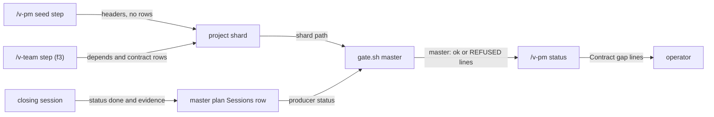

# pm-shard-contracts — architecture spec

## File tree

```text
templates/_features/project-shard.md                   existing, gains depends and the contracts section
commands/v-pm/steps/04-seed-workspace.md               existing, seeds the two new headers with no rows
commands/v-pm/steps/07-status.md                       existing, runs gate.sh master per open shard
commands/v-work/steps/05-commit-capture.md             existing, gains the master-plan close bullet
tests/unit/v-pm.bats                                   existing, guards the four files
vault/plans/2026-09-21-0900-architecture-first-planning.md   existing, S12 row done
vault/plans/2026-09-21-0900-architecture-first-planning.human.html   existing, re-rendered
checks/shard-contracts-SC-1.sh to SC-4.sh              new, decide the four criteria
```

## Files

| path | new | purpose | loaded |
|------|-----|---------|--------|
| templates/_features/project-shard.md | no | source of every project shard | on-demand |
| commands/v-pm/steps/04-seed-workspace.md | no | seeds a feature workspace | on-demand |
| commands/v-pm/steps/07-status.md | no | prints the feature digest | on-demand |
| commands/v-work/steps/05-commit-capture.md | no | close step of a work session | always |
| tests/unit/v-pm.bats | no | guards the v-pm text | never-by-agent |
| vault/plans/2026-09-21-0900-architecture-first-planning.md | no | master plan and session tracker | on-demand |
| vault/plans/2026-09-21-0900-architecture-first-planning.human.html | no | rendered page of the master plan | never-by-agent |
| checks/shard-contracts-SC-1.sh | yes | decides criterion SC-1 | never-by-agent |
| checks/shard-contracts-SC-2.sh | yes | decides criterion SC-2 | never-by-agent |
| checks/shard-contracts-SC-3.sh | yes | decides criterion SC-3 | never-by-agent |
| checks/shard-contracts-SC-4.sh | yes | decides criterion SC-4 | never-by-agent |

## Data flow



## Interfaces

| interface | method | params | returns | throws | layer |
|-----------|--------|--------|---------|--------|-------|
| bin/gate.sh | master | plan: path | master: ok, or REFUSED lines, exit 0 or 1 | exit 2 on an unreadable file | cli |

## Load order

| trigger | loads | tokens-max |
|---------|-------|------------|
| /v-pm status opens a shard | bin/gate.sh through the step text | 0 |

## Reuse map

| need | existing symbol | decision | reason |
|------|-----------------|----------|--------|
| check a shard's dependencies | bin/gate.sh cmd_master | reuse | the shard has a Sessions table, so the gate reads it unchanged |
| table rules for the contracts section | templates/master-plan.md | reuse | the shard copies its section; one home for the rules |
| guard the text of a v-pm file | tests/unit/v-pm.bats | extend | the shard cases live there |
| close duty of a master plan row | commands/_shared/definition-of-done.md | reuse | its F table stays for feature shards; the new bullet points at the gate instead of restating rows |

## Size budgets

| path | max lines |
|------|-----------|
| templates/_features/project-shard.md | 90 |

## Config points

n/a: the change reads no setting.
