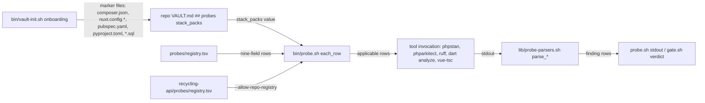

# stack-packs — architecture spec

## File tree

```text
lib/probe-parsers.sh                                   existing, adds parse_phpstan_json, parse_phparkitect_json, parse_ruff_json, parse_dart_machine, parse_tsc_text
probes/registry.tsv                                    existing, gains five rows: laravel-phpstan, laravel-arkitect, nuxt-tsc, dart-analyze, python-ruff
bin/probe.sh                                            existing, gains probe_vault_key and a stack_packs row filter
bin/vault-init.sh                                       existing, detects laravel/nuxt/flutter/python/sql markers, writes stack_packs
templates/VAULT.md                                      existing, gains a ## probes section documenting stack_packs
commands/_shared/probe-kit.md                           existing, documents the stack_packs key in the Registry section
tests/unit/probe.bats                                   existing, gains T-40 to T-45
tests/fixtures/probe/phpstan.json                       new, real PHPStan --error-format=json payload
tests/fixtures/probe/phparkitect.json                   new, real phparkitect check --format=json payload
tests/fixtures/probe/ruff.json                          new, real ruff check --output-format json payload
tests/fixtures/probe/dart-analyze.txt                   new, real dart analyze --format=machine output
tests/fixtures/probe/vue-tsc.txt                        new, real vue-tsc --noEmit diagnostic line
checks/stack-packs-SC-1.sh to SC-7.sh                   new, decide the seven criteria
recycling-api/probes/registry.tsv                       new, in the recycling-api repo: one repo-scoped row, laravel-phpstan-docker
```

## Files

| path | new | purpose | loaded |
|------|-----|---------|--------|
| lib/probe-parsers.sh | no | turns one external tool's stdout into probe finding rows | on-demand |
| probes/registry.tsv | no | one row per probe: id, stack, stage, detect, run, parser, cost, executes-repo-code, install | on-demand |
| bin/probe.sh | no | the probe CLI: list, detect, run, diff, scale | on-demand |
| bin/vault-init.sh | no | onboards a repo: writes VAULT.md, including dod_profile and now stack_packs | on-demand |
| templates/VAULT.md | no | source of every repo's VAULT.md, comments document each key | on-demand |
| commands/_shared/probe-kit.md | no | the probe registry contract, binding on every row and reader | always |
| tests/unit/probe.bats | no | probe kit unit tests | never-by-agent |
| tests/fixtures/probe/phpstan.json | yes | fixture for parse_phpstan_json | never-by-agent |
| tests/fixtures/probe/phparkitect.json | yes | fixture for parse_phparkitect_json | never-by-agent |
| tests/fixtures/probe/ruff.json | yes | fixture for parse_ruff_json | never-by-agent |
| tests/fixtures/probe/dart-analyze.txt | yes | fixture for parse_dart_machine | never-by-agent |
| tests/fixtures/probe/vue-tsc.txt | yes | fixture for parse_tsc_text | never-by-agent |
| checks/stack-packs-SC-1.sh | yes | decides criterion SC-1 | never-by-agent |
| checks/stack-packs-SC-2.sh | yes | decides criterion SC-2 | never-by-agent |
| checks/stack-packs-SC-3.sh | yes | decides criterion SC-3 | never-by-agent |
| checks/stack-packs-SC-4.sh | yes | decides criterion SC-4 | never-by-agent |
| checks/stack-packs-SC-5.sh | yes | decides criterion SC-5 | never-by-agent |
| checks/stack-packs-SC-6.sh | yes | decides criterion SC-6 | never-by-agent |
| checks/stack-packs-SC-7.sh | yes | decides criterion SC-7 | never-by-agent |
| recycling-api/probes/registry.tsv | yes | one repo-scoped probe row: run PHPStan inside recycling-api's own Docker image | never-by-agent |

## Data flow



## Interfaces

| interface | method | params | returns | throws | layer |
|-----------|--------|--------|---------|--------|-------|
| bin/probe.sh | probe_vault_key | file: path, key: string | the raw value after the first matching `key:` line, or nothing | returns 1 when the file or key is absent | cli |
| bin/probe.sh | each_row (extended) | repo: path | skips a named-stack row not listed in `$repo/VAULT.md` stack_packs; unchanged when the key is absent | - | cli |
| lib/probe-parsers.sh | parse_phpstan_json | id: string, repo: path, stdin: PHPStan JSON | finding rows via probe_finding | returns 3 when jq is absent | native |
| lib/probe-parsers.sh | parse_phparkitect_json | id: string, repo: path, stdin: PHPArkitect JSON | finding rows via probe_finding, file derived from the FQCN under App\ -> app/ | returns 3 when jq is absent | native |
| lib/probe-parsers.sh | parse_ruff_json | id: string, repo: path, stdin: ruff JSON array | finding rows via probe_finding | returns 3 when jq is absent | native |
| lib/probe-parsers.sh | parse_dart_machine | id: string, repo: path, stdin: pipe-delimited lines | finding rows via probe_finding | - | native |
| lib/probe-parsers.sh | parse_tsc_text | id: string, repo: path, stdin: `path(line,col): error TSxxxx: msg` lines | finding rows via probe_finding | - | native |
| bin/vault-init.sh | stack detection block | cwd: path | writes `stack_packs: <ids>` to VAULT.md's ## probes section | - | cli |

## Load order

| trigger | loads | tokens-max |
|---------|-------|------------|
| `bin/probe.sh list\|detect\|run\|diff` starts | probes/registry.tsv, lib/probe-parsers.sh | 400 |
| `bin/vault-init.sh` runs (onboarding) | repo marker files (composer.json, nuxt.config.*, pubspec.yaml, pyproject.toml, requirements.txt, *.sql) | 200 |

## Reuse map

| need | existing symbol | decision | reason |
|------|-----------------|----------|--------|
| turn one tool's stdout into finding rows | lib/probe-parsers.sh parse_lizard_csv | extend | same file, same `parse_<name>(id, repo)` shape already used by lizard and typos |
| emit one finding row | lib/probe-emit.sh probe_finding | reuse | every parser and native probe already calls this, never `printf` |
| read a VAULT.md key by first match | lib/arch-check.sh vault_key | new | arch-check.sh states in its own header "Sourced by gate.sh, never run on its own" and depends on gate.sh's `die`/`violations`/`frontmatter_get`; sourcing it into probe.sh would widen that contract for two self-contained lines, so `probe_vault_key` repeats the small awk helper instead — same tolerated duplication the master plan already records for arch-check.sh's row-loop |
| stack marker detection | commands/v-work/steps/01-analyze.md §1.3 stack table | reuse | same marker files (composer.json+Laravel, package.json+nuxt, pubspec.yaml, pyproject.toml/requirements.txt) this repo already uses to detect a project's stack in ANALYZE |
| gate a registry row on repo config | probes/registry.tsv detect cell (existing mechanism) | extend | stack_packs adds a second, VAULT.md-level gate in front of the per-row detect cell; detect still runs and still decides applicability when stack_packs is silent |
| onboarding-detected, hand-editable VAULT.md key | templates/VAULT.md ## definition of done (dod_profile et al.) | reuse | same pattern: "written by bin/vault-init.sh and confirmed by you" |
| run a repo's own tool inside that repo's own container | probes/registry.tsv `--allow-repo-registry` mechanism | reuse | the contract already lets a repo add its own rows; `laravel-phpstan-docker` is an ordinary repo-scoped row, not a new mechanism |
| parse PHPStan JSON emitted from inside a container path (`/app/...`) | parse_phpstan_json (this plan, W-1) | reuse | the `recycling-api` row's own `run` cell strips the `/app/` prefix with `sed` before the parser ever sees it, so the parser stays container-agnostic |

## Size budgets

| path | max lines |
|------|-----------|
| bin/probe.sh | 190 |
| lib/probe-parsers.sh | 210 |
| bin/vault-init.sh | 450 |
| probes/registry.tsv | 22 |
| templates/VAULT.md | 120 |
| commands/_shared/probe-kit.md | 155 |
| tests/unit/probe.bats | 520 |

## Config points

| key | file | default |
|-----|------|---------|
| `stack_packs` | a repo's `VAULT.md`, `## probes` section | none — every row's own `detect` cell alone decides applicability |
