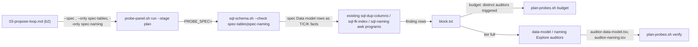

# spec-reading-probes — architecture spec

Contract: commands/_shared/architecture-spec.md. `bin/gate.sh arch` refuses a spec that breaks it.

## File tree

```text
probes/sql-schema.sh                          existing, gains spec-tables and spec-naming checks
probes/registry.tsv                            existing, two new rows
commands/_shared/plan-probes.md                existing, Auditors section rewritten to a table + one shared envelope
commands/_shared/probe-kit.md                  existing, Checks and rules table gains two rows
bin/plan-probes.sh                             existing, PLAN_PROBES/AUDITORS extended, budget counts distinct auditors, verify takes several rows files
commands/v-team/steps/03-propose-loop.md       existing, step (b2) --only list and step (g) verify call extended
tests/unit/probe.bats                          existing, spec-tables/spec-naming cases added
tests/unit/plan-probes.bats                    existing, pinned probes/auditors strings and budget/verify tests updated
tests/fixtures/probe/spec-data-model-bad.arch.md   new, a Data model table with one defect of each rule
tests/fixtures/probe/spec-data-model-clean.arch.md new, a Data model table that breaks no rule
```

## Files

| path | new | purpose | loaded |
|------|-----|---------|--------|
| probes/sql-schema.sh | no | reads real SQL and, when `--spec` names a file, the spec's Data model table, into one fact stream and runs the existing checks over it | on-demand |
| probes/registry.tsv | no | declares which probes exist, at which stage, and how to run them | on-demand |
| commands/_shared/plan-probes.md | no | owns the plan-time probe stage: tier, auditors, verify, the notes at the approval gate | on-demand |
| commands/_shared/probe-kit.md | no | owns the probe registry format and the checks-and-rules table | on-demand |
| bin/plan-probes.sh | no | the tier, verify and measure commands the stage calls | on-demand |
| commands/v-team/steps/03-propose-loop.md | no | step (b2) calls the stage; step (g) calls verify | on-demand |
| tests/unit/probe.bats | no | unit coverage for `probes/*.sh` | never-by-agent |
| tests/unit/plan-probes.bats | no | unit coverage for `bin/plan-probes.sh` | never-by-agent |
| tests/fixtures/probe/spec-data-model-bad.arch.md | yes | a spec whose Data model table trips one row per new rule | never-by-agent |
| tests/fixtures/probe/spec-data-model-clean.arch.md | yes | a spec whose Data model table trips nothing | never-by-agent |

## Data flow



## Interfaces

| interface | method | params | returns | throws | layer |
|-----------|--------|--------|---------|--------|-------|
| sql-schema.sh | --check spec-tables | repo: path, spec: path | finding rows on stdout | exit 2 on usage error | cli |
| sql-schema.sh | --check spec-naming | repo: path, spec: path | finding rows on stdout | exit 2 on usage error | cli |
| plan-probes.sh | budget | critics: int, rounds: int, block: path, out: path | tier + projected + note lines, tier.txt | exit 2 on bad input | cli |
| plan-probes.sh | verify | outdir: path, rowsfiles: path | open:/note: lines | exit 1 open row, exit 2 unreadable | cli |

## Load order

| trigger | loads | tokens-max |
|---------|-------|------------|
| step (b2) starts | commands/_shared/plan-probes.md | 1500 |
| tier full, spec-tables or spec-naming rows present | the data-model or naming auditor envelope | 2000 |

## Reuse map

| need | existing symbol | decision | reason |
|------|-----------------|----------|--------|
| parse SQL text into T/C/K facts | lib/probe-sql.sh sql_facts | reuse | the spec's Data model table becomes one more fact source, read into the same three-letter format, so the checks below need no change |
| duplicate/drift/missing-index checks over table facts | probes/sql-schema.sh sql-dup-columns, sql-fk-index awk | reuse | spec-tables feeds spec facts and real facts into the same awk programs, unchanged |
| snake_case + glossary naming check | probes/sql-schema.sh sql-naming awk | reuse | spec-naming feeds spec facts into the same awk program, unchanged |
| existence-style spec-vs-code probe pattern | probes/similar-symbols.sh --check spec-symbols | reuse | spec-tables/spec-naming follow the same shape: gated on `test -n "$PROBE_SPEC"`, native, stage plan, stack any |
| Explore/haiku read-only auditor pattern | commands/_shared/plan-probes.md Auditor reuse envelope | extend | the reuse envelope becomes one shared template parameterised by id/reads/question, holding three rows instead of one prose block per auditor |
| distinct-auditor cost counting | bin/plan-probes.sh pp_budget aud | extend | the current binary `aud` undercounts once a second independently-triggerable auditor exists; it becomes a count over the AUDITORS table |

## Size budgets

| path | max lines |
|------|-----------|
| probes/sql-schema.sh | 160 |
| commands/_shared/plan-probes.md | 110 |
| bin/plan-probes.sh | 246 (round-2 diff review, quality-r1: the variadic `pp_verify` loop and its missing-auditor-note check are load-bearing, not bloat — raised from 240 rather than trimmed) |

## Config points

n/a: no new setting — spec-tables/spec-naming reuse PROBE_SQL, PROBE_FILE_MAX and the existing glossary path
