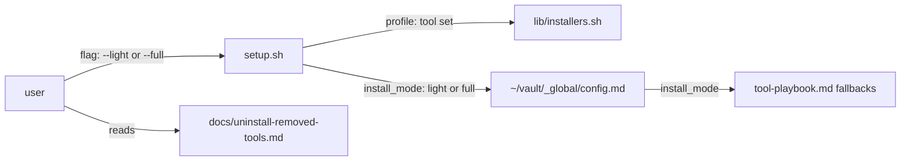

# remove-mcp-tools — architecture spec

## File tree

```text
setup.sh                                        existing, loses the claude-mem and Graphify steps and --minimal
lib/installers.sh                               existing, loses bun, pipx, claude-mem and graphify functions
bin/vault-uninstall.sh                          existing, loses the claude-mem removal
docs/uninstall-removed-tools.md                 new
tool-playbook.md                                existing, loses three tool sections
bin/vault-init.sh                               existing, loses the graph hook step
commands/**, vault-guide.md, INSTALL.md         existing, mentions removed
vault/decisions/ADR-032-remove-memory-and-edit-mcps.md   new
checks/mcp-purge-SC-1.sh … SC-6.sh              new
vault/sessions/2026-06-19-1526-setup-zstd-fixes.md       new name for an existing session
```

## Files

| path | new | purpose | loaded |
|------|-----|---------|--------|
| .gitignore | no | files git ignores | on-demand |
| INSTALL.md | no | install instructions for a user | on-demand |
| bin/vault-init.sh | no | onboard a repo into the vault | on-demand |
| bin/vault-sync.sh | no | one framework script | on-demand |
| bin/vault-uninstall.sh | no | remove what setup.sh installed | on-demand |
| commands/v-ask.md | no | instructions for one command or step | on-demand |
| commands/v-capture.md | no | instructions for one command or step | on-demand |
| commands/v-cr.md | no | instructions for one command or step | on-demand |
| commands/v-cr/steps/02-gather.md | no | instructions for one command or step | on-demand |
| commands/v-do.md | no | instructions for one command or step | on-demand |
| commands/v-guide.md | no | instructions for one command or step | on-demand |
| commands/v-init.md | no | instructions for one command or step | on-demand |
| commands/v-loop.md | no | instructions for one command or step | on-demand |
| commands/v-pm.md | no | instructions for one command or step | on-demand |
| commands/v-pm/steps/02-load-context.md | no | instructions for one command or step | on-demand |
| commands/v-pm/steps/05-capture.md | no | instructions for one command or step | on-demand |
| commands/v-setup.md | no | instructions for one command or step | on-demand |
| commands/v-team.md | no | instructions for one command or step | on-demand |
| commands/v-work.md | no | instructions for one command or step | on-demand |
| commands/v-work/steps/02-load-context.md | no | instructions for one command or step | on-demand |
| commands/v-work/steps/03-propose.md | no | instructions for one command or step | on-demand |
| commands/v-work/steps/04-execute.md | no | instructions for one command or step | on-demand |
| commands/v-work/steps/05-commit-capture.md | no | instructions for one command or step | on-demand |
| lib/installers.sh | no | per-tool check and install functions plus the doctor | on-demand |
| personas/api-laravel.md | no | one reviewer persona | on-demand |
| personas/flutter.md | no | one reviewer persona | on-demand |
| personas/nuxt.md | no | one reviewer persona | on-demand |
| prompts/consolidate-into-indications.md | no | a reusable prompt | on-demand |
| scripts/detect-stack.sh | no | one helper script | on-demand |
| sessions/2026-06-02-1156-v-guide-command.md | no | one session record | never-by-agent |
| setup.sh | no | umbrella installer; choose the profile and run each tool step | on-demand |
| templates/project-moc.md | no | a template copied into project vaults | on-demand |
| templates/vault.gitignore | no | a template copied into project vaults | on-demand |
| tests/e2e/Dockerfile.ubuntu | no | tests for the installer or a command | never-by-agent |
| tests/e2e/autoinstall.bats | no | tests for the installer or a command | never-by-agent |
| tests/e2e/run.sh | no | tests for the installer or a command | never-by-agent |
| tests/integration/setup.bats | no | tests for the installer or a command | never-by-agent |
| tests/integration/vault-sync.bats | no | tests for the installer or a command | never-by-agent |
| tests/integration/vault-uninstall.bats | no | tests for the installer or a command | never-by-agent |
| tests/unit/gitignore.bats | no | tests for the installer or a command | never-by-agent |
| tests/unit/plugin-install.bats | no | tests for the installer or a command | never-by-agent |
| tests/unit/setup-autoinstall.bats | no | tests for the installer or a command | never-by-agent |
| tests/unit/v-pm.bats | no | tests for the installer or a command | never-by-agent |
| tool-playbook.md | no | when and how an agent uses each optional tool | on-demand |
| vault-guide.md | no | the framework process guide | on-demand |
| vault/.gitignore | no | one framework document | on-demand |
| vault/_feature-index.md | no | a vault index | on-demand |
| vault/_moc.md | no | a vault index | on-demand |
| vault/decisions/ADR-005-installer-auto-exec.md | no | one architecture decision record | on-demand |
| vault/decisions/ADR-007-light-siblings-guardrail.md | no | one architecture decision record | on-demand |
| vault/decisions/ADR-008-v-cr-remote-pr-review.md | no | one architecture decision record | on-demand |
| vault/decisions/ADR-020-claude-code-plugin-distribution.md | no | one architecture decision record | on-demand |
| vault/decisions/ADR-021-install-profiles.md | no | one architecture decision record | on-demand |
| vault/decisions/ADR-022-vault-git-autosync.md | no | one architecture decision record | on-demand |
| vault/decisions/ADR-026-mechanical-session-gates.md | no | one architecture decision record | on-demand |
| vault/decisions/_inventory.md | no | one architecture decision record | on-demand |
| vault/features/install-distribution.md | no | one feature dossier | on-demand |
| vault/features/vault-git-sync.md | no | one feature dossier | on-demand |
| vault/indications/_index.md | no | one working rule or its index | on-demand |
| vault/indications/light-command-siblings.md | no | one working rule or its index | on-demand |
| vault/indications/per-user-installer-no-sudo.md | no | one working rule or its index | on-demand |
| vault/indications/tools-suggestions-not-rules.md | no | one working rule or its index | on-demand |
| vault/indications/verify-plugin-marketplace-qualifier.md | no | one working rule or its index | on-demand |
| vault/plans/2026-06-18-1518-setup-auto-install.md | no | one plan or its process record | never-by-agent |
| vault/plans/2026-06-18-1518-setup-auto-install.trail.md | no | one plan or its process record | never-by-agent |
| vault/plans/2026-06-19-1106-v-cr-command.md | no | one plan or its process record | never-by-agent |
| vault/plans/2026-06-22-1152-framework-hooks-tools-rename.md | no | one plan or its process record | never-by-agent |
| vault/plans/2026-07-04-1030-v-family-usage-audit-retiering.md | no | one plan or its process record | never-by-agent |
| vault/plans/2026-07-20-1030-team-presentation-vault-commands.trail.md | no | one plan or its process record | never-by-agent |
| vault/plans/2026-08-04-install-profiles-light-full.md | no | one plan or its process record | never-by-agent |
| vault/plans/2026-08-04-vault-git-autosync.md | no | one plan or its process record | never-by-agent |
| vault/plans/2026-09-01-1000-vcr-delivery-and-coverage.md | no | one plan or its process record | never-by-agent |
| vault/plans/2026-09-01-1000-vcr-delivery-and-coverage.trail.md | no | one plan or its process record | never-by-agent |
| vault/plans/2026-09-04-0900-mechanical-session-gates.md | no | one plan or its process record | never-by-agent |
| vault/plans/2026-09-14-1327-framework-extension-points.md | no | one plan or its process record | never-by-agent |
| vault/plans/2026-09-21-1130-probe-kit-core.arch.md | no | one plan or its process record | never-by-agent |
| vault/plans/2026-09-21-1130-probe-kit-core.human.html | no | one plan or its process record | never-by-agent |
| vault/research/subagent-token-economics.md | no | one research note | on-demand |
| vault/sessions/2026-06-18-1518-setup-auto-install.md | no | one session record | never-by-agent |
| vault/sessions/2026-06-19-0831-setup-sudo-deadlock-fix.md | no | one session record | never-by-agent |
| vault/sessions/2026-06-19-1114-light-command-siblings.md | no | one session record | never-by-agent |
| vault/sessions/2026-06-22-1152-framework-hooks-tools-rename.md | no | one session record | never-by-agent |
| vault/sessions/2026-06-29-1233-humanize-docs.md | no | one session record | never-by-agent |
| vault/sessions/2026-07-04-1115-v-family-usage-audit-retiering.md | no | one session record | never-by-agent |
| vault/sessions/2026-08-04-1339-install-profiles-light-full.md | no | one session record | never-by-agent |
| vault/indications/gate-prompts-on-stdin-tty.md | no | one working rule or its index | on-demand |
| commands/v-method.md | no | instructions for one command or step | on-demand |
| commands/v-reconcile.md | no | instructions for one command or step | on-demand |
| commands/v-team/steps/03-propose-loop.md | no | instructions for one command or step | on-demand |
| vault/indications/installer-dry-run-seam.md | no | one working rule | on-demand |
| tests/integration/vault-sync.bats | no | tests for vault sync | never-by-agent |
| tests/unit/gitignore.bats | no | tests for the gitignore templates | never-by-agent |
| tests/e2e/run.sh | no | the e2e test runner | never-by-agent |
| tests/e2e/Dockerfile.ubuntu | no | the e2e test image | never-by-agent |
| vault/.gitignore | no | files git ignores in this vault | never-by-agent |
| vault/sessions/2026-06-19-1526-setup-zstd-fixes.md | yes | one session record, renamed from its old claude-mem name | never-by-agent |
| docs/uninstall-removed-tools.md | yes | tell a user how to remove the dropped tools from their machine | on-demand |
| vault/decisions/ADR-032-remove-memory-and-edit-mcps.md | yes | record that the framework prescribes no memory plugin, edit MCP or code graph | on-demand |
| checks/mcp-purge-SC-1.sh | yes | grade SC-1 | never-by-agent |
| checks/mcp-purge-SC-2.sh | yes | grade SC-2 | never-by-agent |
| checks/mcp-purge-SC-3.sh | yes | grade SC-3 | never-by-agent |
| checks/mcp-purge-SC-4.sh | yes | grade SC-4 | never-by-agent |
| checks/mcp-purge-SC-5.sh | yes | grade SC-5 | never-by-agent |
| checks/mcp-purge-SC-6.sh | yes | grade SC-6 | never-by-agent |

## Data flow



## Interfaces

| interface | method | params | returns | throws | layer |
|-----------|--------|--------|---------|--------|-------|
| setup.sh | cli | profile: --light or --full, tool: --with-serena, mode: --dry-run or --yes | exit code | exit 2 on an unknown flag | cli |
| bin/vault-uninstall.sh | cli | scope: --tools | exit code | - | cli |

## Load order

| trigger | loads | tokens-max |
|---------|-------|------------|
| a command step reaches a tool choice | tool-playbook.md | 4000 |
| a user removes the old tools | docs/uninstall-removed-tools.md | 1500 |

## Reuse map

| need | existing symbol | decision | reason |
|------|-----------------|----------|--------|
| install Serena | lib/installers.sh install_serena | reuse | unchanged |
| remove Serena | bin/vault-uninstall.sh --tools | extend | loses its graphifyy and plugin steps |
| grade a criterion | checks/stack-packs-SC-7.sh | extend | same exit-code contract, copied per plan as every plan does |

## Size budgets

| path | max lines |
|------|-----------|
| docs/uninstall-removed-tools.md | 120 |
| tool-playbook.md | 200 |
| vault/decisions/ADR-032-remove-memory-and-edit-mcps.md | 80 |

## Config points

| key | file | default |
|-----|------|---------|
| install_mode | ~/vault/_global/config.md | light |
