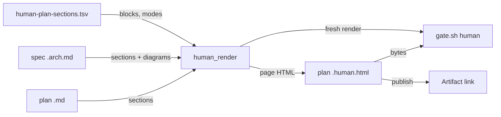

# human-page-essentials — architecture spec

## File tree

```text
templates/human-plan-sections.tsv        existing, rewritten as the four-field page list
lib/human-render.sh                      existing, gains the modes and the diagram rule
lib/arch-check.sh                        existing, loses the @ skip
commands/_shared/human-plan.md           existing, page contract rewritten
arch-profiles/code.tsv                   existing, loses @review lines
arch-profiles/harness.tsv                existing, loses @review lines
templates/plan.md                        existing, names the shown statuses
checks/human-page-SC-1.sh .. SC-6.sh     new
```

## Files

| path | new | purpose | loaded |
|------|-----|---------|--------|
| templates/human-plan-sections.tsv | no | the list of page blocks, their source section, mode and heading | never-by-agent |
| lib/human-render.sh | no | the awk programs that build the page | never-by-agent |
| lib/arch-check.sh | no | the spec validator behind `bin/gate.sh arch` | never-by-agent |
| commands/_shared/human-plan.md | no | the page contract | on-demand |
| arch-profiles/code.tsv | no | the code profile's sections | never-by-agent |
| arch-profiles/harness.tsv | no | the harness profile's sections | never-by-agent |
| arch-profiles/code.md | no | the code profile's starting text | on-demand |
| arch-profiles/harness.md | no | the harness profile's starting text | on-demand |
| templates/plan.md | no | the plan skeleton | on-demand |
| tests/unit/human-plan.bats | no | renderer and human-gate tests | never-by-agent |
| tests/unit/gate.bats | no | gate tests, the profile loader included | never-by-agent |
| tests/fixtures/human/plan.md | no | the fixture plan every page test renders | never-by-agent |
| tests/fixtures/human/expected.html | no | the golden page | never-by-agent |
| tests/fixtures/arch/code-complete.arch.md | no | the code-profile fixture spec | never-by-agent |
| checks/human-page-fixture.sh | yes | the plan and spec the page checks render | never-by-agent |
| checks/human-page-SC-1.sh | yes | evidence for SC-1 | never-by-agent |
| checks/human-page-SC-2.sh | yes | evidence for SC-2 | never-by-agent |
| checks/human-page-SC-3.sh | yes | evidence for SC-3 | never-by-agent |
| checks/human-page-SC-4.sh | yes | evidence for SC-4 | never-by-agent |
| checks/human-page-SC-5.sh | yes | evidence for SC-5 | never-by-agent |
| checks/human-page-SC-6.sh | yes | evidence for SC-6 | never-by-agent |
| checks/human-SC-1.sh | no | evidence for the earlier page plan | never-by-agent |
| checks/human-SC-8.sh | no | evidence for the earlier page plan | never-by-agent |
| checks/human-SC-9.sh | no | evidence for the earlier page plan | never-by-agent |
| vault/features/architecture-spec.md | no | the feature dossier | on-demand |
| .claude-plugin/plugin.json | no | the plugin manifest and its version | never-by-agent |

## Data flow



## Interfaces

| interface | method | params | returns | throws | layer |
|-----------|--------|--------|---------|--------|-------|
| bin/render-human.sh | render | plan: path, repo: path, stdout: flag | exit code | exit 2 on an unknown mode | cli |
| lib/human-render.sh | human_render | plan: path, repo: path, to_stdout: int | page HTML | die | lib |
| HUMAN_AWK_LIB | keep_item | text: string, words: string | bool | - | awk |
| HUMAN_AWK_LIB | er_diagram | rows: table | mermaid text | - | awk |
| HUMAN_AWK_LIB | signatures | rows: table | HTML list | - | awk |
| HUMAN_AWK_LIB | strip_params | line: string | mermaid line | - | awk |

## Load order

| trigger | loads | tokens-max |
|---------|-------|------------|
| `/v-team` PROPOSE step (g) renders the page | commands/_shared/human-plan.md | 1500 |
| `/v-team` PROPOSE step (a) drafts a spec | commands/_shared/architecture-spec.md | 2500 |

## Reuse map

| need | existing symbol | decision | reason |
|------|-----------------|----------|--------|
| table cell split | lib/human-render.sh cells | reuse | already splits escaped pipes the way the gate does |
| block rendering | lib/human-render.sh block | extend | modes filter rows and columns before the same output |
| mermaid safety | lib/human-render.sh hostile | reuse | generated diagrams pass the same line filter |
| fence scan | lib/arch-check.sh arch_fence_check | extend | the label check walks the same fenced blocks |
| plain label text | lib/human-render.sh plain | reuse | entity and type names in the erDiagram need the same character set |

## Size budgets

| path | max lines | max method lines |
|------|-----------|------------------|
| lib/human-render.sh | 430 | 60 |
| lib/arch-check.sh | 430 | 60 |

## Config points

<!-- The rows of templates/human-plan-sections.tsv, in page order. Fields: source, section, mode, cols, heading. -->

| key | file | default |
|-----|------|---------|
| plan · Task · task · * | templates/human-plan-sections.tsv | heading Task |
| plan · Open & deferred · match:status\|state:operator · * | templates/human-plan-sections.tsv | heading Needs your decision |
| plan · Open & deferred · match:status\|state:user-visible\|user visible · * | templates/human-plan-sections.tsv | heading Users will notice |
| plan · Open questions · match:status:defaulted · question answer | templates/human-plan-sections.tsv | heading Defaults taken for you |
| plan · Success criteria · match:how:observed · id criterion check | templates/human-plan-sections.tsv | heading Checks you run yourself |
| plan · Sessions · all · id scope depends | templates/human-plan-sections.tsv | heading Sessions, followed by the session graph |
| plan · Cross-session contracts · all · * | templates/human-plan-sections.tsv | heading Cross-session contracts |
| spec · Data model · er · * | templates/human-plan-sections.tsv | heading Data model |
| spec · File tree · all · * | templates/human-plan-sections.tsv | heading File tree |
| spec · Data flow · labels · * | templates/human-plan-sections.tsv | heading Data flow |
| spec · Interfaces · signatures · * | templates/human-plan-sections.tsv | heading Interfaces |
